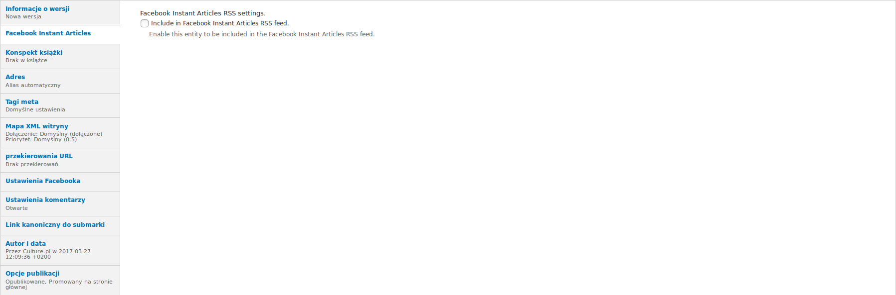
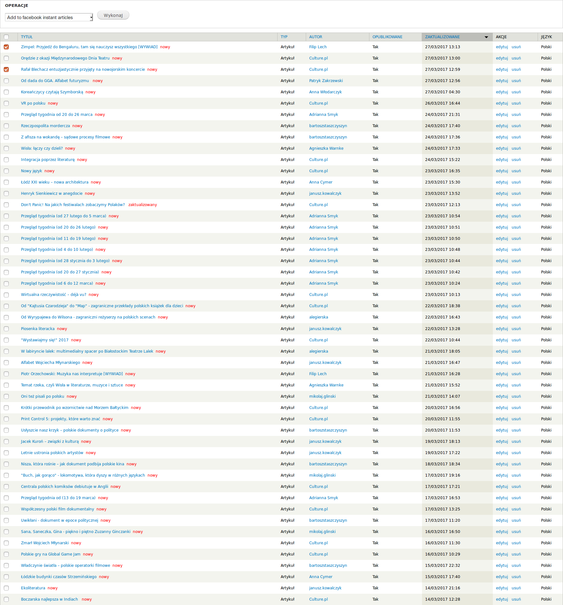

# Culture.pl - Dokumentacja użytkownika #
Podręcznik użytkownika redakcyjnego strony Culture.pl

## Facebook Instant Articles (FBIA)

### Wprowadzenie

Mechanizm publikacji pozwala publikować dzieła, twórców i artykuły w ramach serwisu culture.pl na platformie Facebook Instant Articles. 

### Publikacja treści na FBIA

Domyślnie, żadne treści nie są publikowane na kanale FBIA. By opublikować treść, w formularzu edycji tej treści należy zaznaczyć *"Facebook Instant Articles"* =>  *"Include in Facebook Instant Articles RSS feed."*

### Masowa publikacja treści na FBIA

Możliwe jest publikowanie treści w wielu treściach na raz. By to zrobić należy na podstronie administracji zawartości (http://culture.pl/pl/admin/content), zaznaczenie artykułów, twórców i dzieł, które chcemy opublikować i wybrać opcję "Add to facebook instant articles."

### Weryfikacja treści przed publikacją

By sprawdzić wygląd artykułów eksportowanych z culture.pl do FBIA, należy użyć aplikacji Facebook Manager. 
Wygląd artykułów można sprawdzić w aplikacji w zakładce "Artykuły ekspresowe" > "Projektowanie".
